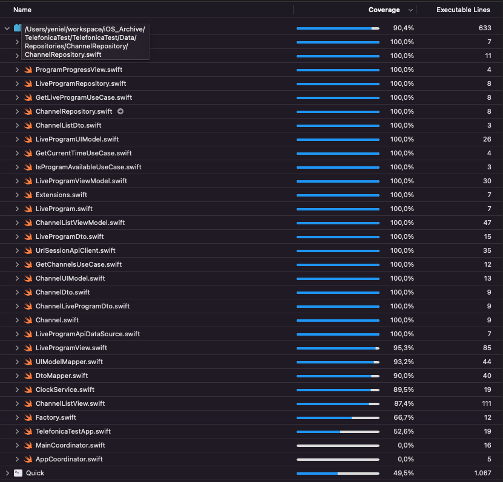

# Telefonica Test

[](https://app.bitrise.io/app/b461c3510d5187c1)
[](https://codecov.io/gh/yeniel/TelefonicaTest)
[](https://swift.org)
[](https://apple.com)

This is my implementation of a Telefonica Technical Test. The specification readme is [here](https://gitlab.com/kisanagi2242/movistar-technicaltryout/-/blob/main/README.md).

## Table of contents

1. [Installation](#installation)
2. [Third Party](#third-party)
3. [Architecture and Design Patterns](#architecture-and-design-patterns)
4. [Unit Tests](#unit-tests)
5. [CI](#ci)
6. [Other considerations](#other-considerations)


## Installation

1. Download the project:
```
git clone https://github.com/yeniel/TelefonicaTest.git
```
2. Wait until all Swift Package Manager are fetched

## Third Party

1. CocoaPods
	- [SwiftLint](https://github.com/realm/SwiftLint): Linter I have used to static code analysis. 
2. Swift Package Manager
	- [Factory](https://github.com/hmlongco/Factory): Dependency injector, it uses container-based dependency injection pattern
	- [Stinsen](https://github.com/rundfunk47/stinsen): Router, it uses the coordinator pattern
	- [Quick - Nimble](https://github.com/Quick/Quick): Unit tests and assertions
	- [SnapshotTesting](https://github.com/pointfreeco/swift-snapshot-testing): I used to work with facebook pod. Afterward I used uber pod. This time I want to try the new one from Point Free guys.
	- [OHHTTPStubs](https://github.com/AliSoftware/OHHTTPStubs): Stub network requests to test data layer.

## Architecture and Design Patterns

First of all, I want to say that when I thought this app it was as a big project. Therefore this project, in the future, could have more features, and all the current ones could be more complex.
In some parts the design patterns seem like an overkill or maybe add needless complexity, but I chose them to show my knowledge.

I tried to follow the bases of a **Clean Architecture** and the **SOLID** principles. The intention is to have a testable, robust and scalable code and avoid the following bad smells:
- God entities
- Repeated code
- Non testable code
- Coupled code
- Lower cohesion

### Data Layer

#### Channel List and Live Program
I implemented the **repository pattern** for channel list request and live program request. The repository pattern is good to manage collection of items. For currentTime I used a service.

The concrete implementation of the api client is based in `URLSession`.
I only implemented one data source which is the api data source. But this design pattern let the code prepared to implement a cache system. The concrete implementation of this local data source could be based on `CoreData` or *Realm*.
The cache logic have to be added in the repository class and this logic will decide how and when  each data source is used. 
The expiry of the cache could be received from the backend and also will managed in the repository class.
In my opinion a memory data source is not needed. It can be managed directly in the repository.

#### Current Time
I implemented a service (`ClockService`) to get the `currentTime` from the backend. I separated then from the channel list to separate responsabilities. In the future maybe the `currentTime` could be retrieved in a separated request.

#### Dtos
I used data transfer object to parse the json from the request using the `Codable` protocol

#### Dto Mapper
I implemented a mapper to map the dtos to domain models

### Domain Layer
#### Models
Core models of the business.
I designed the *live program* model separated from the *program* model. Then a *program* could be a *live program* or a VOD program (recorded one eg. La Resistencia).
The relation is with **composition** instead of **inheritance**

The model `TelefonicaError` is used through all the app to map the errors to a business error.

#### Use Cases
I used use cases to add the business logic. I assumed that the following restriction "only show details of 24677 program" was a business rule. Maybe it is not, but I used it to show how the use cases work.
Also, use cases helps me to **deacoplate** the layers. The comunication between the presentation layer and data layer is made throught the use cases (I don't have any repository in viewmodels)

### Presentation
I implemented the **MVVM pattern**. The views are in **SwiftUI** and I used **Combine** through all the app for asynch process.

#### ViewModels
The view models contain the presentation logic

#### Routing
I used the *Stinsen* package to deacoplate the navigation logic from the views using the coordinator pattern. This approach helps me to test better in case I have to add more complexity to the navigation in the future.

#### UI Models and Mapper
I mapped domain models to ui models. The intention is to give the views a more specific models and avoid adding logic to it (eg. progress calculation). Also give the view only the data that it needs. Also the access to the properties is quicker (eg. `ChannelUIModel.title` instead of `Channel.liveProgram.program.title`)

## Unit Tests

I used *Quick* for all tests and *Nimble* for the assertions. The `ObjectMother` provides me mocked models. I try to follow as much as I can **FIRST** principles

To increase the speed I change a little the entry point of the app (`TelefonicaTestApp.swift`).
I cut the app to a simple view in case we are running the tests.
I also configured the scheme to randomize the execution order.

The **coverage** is **90,2%**



#### Data
- Repositories: Test map dto to domain model.
- UrlSessionApiClient: Test json parse to Codable Dtos. I used OHHTTPStubs to stub request using mocked jsons.

#### Domain
- Use Cases: Test business logic.

#### Presentation
- ViewModels: Test presentation logic.
- Views: Snapshots to test all the design. The snapshot images are in TelefonicaTestTests/Presentation/Snapshots
- UITests: I didn't do test for the tap of a channel. I think I covered it with the routing test in the viewmodel.

## CI
I chose **Bitrise** as CI. I created a workflow with a trigger on every push on master branch. You can see the badge of the status in the top of this README, and if you click on it you will see the Bitrise builds. There also a badge of code coverage.

I added the following steps:
1. Build
2. Run tests
3. Send coverage to [Codecov](https://about.codecov.io/)

## Other considerations
#### App Transport Security
- I configured the *ATS* to allow **only** the domain *movistarplus.es* because the channel image urls are not https
```
    <key>NSAppTransportSecurity</key>
    <dict>
      <key>NSAllowsArbitraryLoads</key>
      <false/>
      <key>NSExceptionDomains</key>
      <dict>
        <key>movistarplus.es</key>
        <dict>
          <key>NSIncludesSubdomains</key>
          <true/>
          <key>NSExceptionAllowsInsecureHTTPLoads</key>
          <true/>
        </dict>
      </dict>
    </dict>
```
- The url image for "Canal Cuatro" returns a 404. I put a SF Symbol icon as placeholder.
- Known issues
	- There is a warning in the project: *"ProgressView initialized with an out-of-bounds progress value. The value will be clamped to the range of `0...total`."* I could not clamp the *progress* var to the range *0.0...11.0*. I am not sure but I guess this warning is related to Xcode 14
	- In the console appears the message *"NavigationLink presenting a value must appear inside a NavigationContent-based NavigationView. Link will be disabled."*. I think that could be related with the Stinsen package


