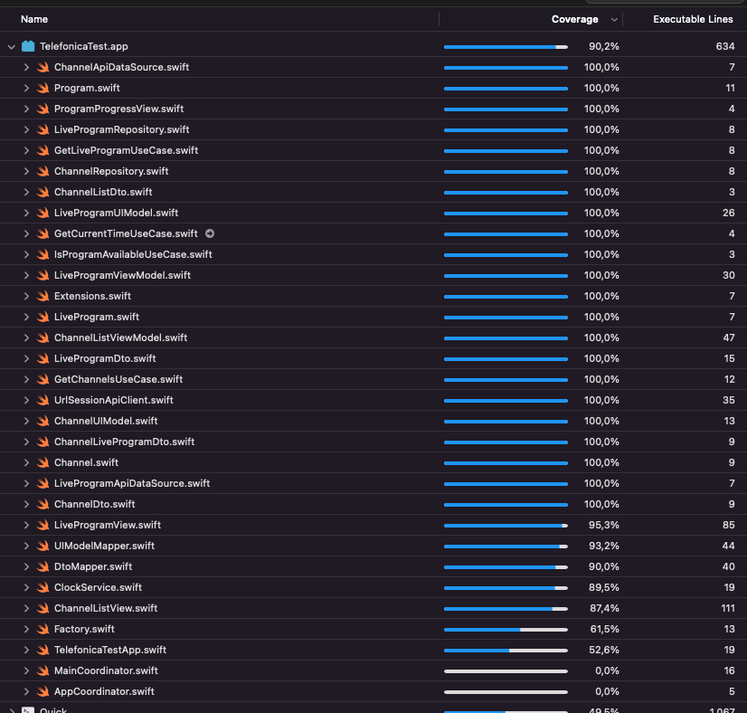

# Telefonica Test

This is my impletation for the Movistar Technical Tryout

### Table of contents

1. [Installation](#install)
2. [Third Party](#thirdparty)
3. [Architecture and Design Patterns](#architecture)
4. [Unit Tests](#unittests)
5. [Other considerations](#otherconsiderations)


### Installation

1. Download the project:
```
git clone https://github.com/yeniel/TelefonicaTest.git
```
2. Go the project root directory
3. Install pods
```
pod install
```

### Third Party

1. CocoaPods
	- [SwiftLint](https://github.com/realm/SwiftLint): Linter I use to static code analysis. 
2. Swift Package Manager
	- [Factory](https://github.com/hmlongco/Factory): Dependency injector, it use container-based dependency injection pattern
	- [Stinsen](https://github.com/rundfunk47/stinsen): Router, it use the coordinator pattern
	- [Quick - Nimble](https://github.com/Quick/Quick): Unit tests and assertions
	- [SnapshotTesting](https://github.com/pointfreeco/swift-snapshot-testing): I had worked with the facebook pod and then uber pod. But this time I want to try the new one from Point Free guys.
	- [OHHTTPStubs](https://github.com/AliSoftware/OHHTTPStubs): Stub network requests to test data layer.

### Architecture and Design Patterns

First at all, I want to say that when I thought this app as a big project. So the project, in the future, could have more features, and all the current ones could be more complex.
Sometimes the design patterns seems like a overkill or add needless complexity, but I choose them to show my knowledge. But in production app, for a small feature, maybe I would go for an easier approach.

I tried to follow the bases of a **Clean Architecture** and the **SOLID** principles. The intention is to have a testable, robust and scalable code and avoid:
- God entities
- Repeated code
- Non testable code
- Coupled code
- Lower cohesion

#### Data Layer

##### Channel List and Live Program
I implemented the **repository pattern** for channel list request and live program request. The repository patterns is good for manage collection of items, for currentTime I used a service.

The concrete implementation of the api client is based in *URLSession*.
I only implemented one data source that is the api data source. But this design pattern lets the code prepared for implement a cached system. The concrete implementation of this local data source could be based on *Core Data* or *Realm*.
The cache logic should be added in the repository class and it decide how and when use each data source. 
The expiry of the cache could be received from the backend and also will managed in the repository class.
In my opinion is not needed a memory data source can be manage directly in the repository.

##### Current Time
I implemented a service *(ClockService)* to get the current time from the backend. I separated then from the channel list to separate responsabilities. Maybe in the future the current time would retrieved in a separated request.

##### Dtos
I used data transfer object to parse the json from the request using the **Codable** protocol

##### Dto Mapper
I implemented a mapper to map the dtos to domain models

#### Domain Layer
##### Models
Core models of the business.
I modeled the program separated than the live program. Then a program could be a live program or a VOD program (recorded one eg. La Resistencia).
The relation is with **composition** instead of inheritance

The model *TelefonicaError* is used through all the app to map the errors to a business error.

##### Use Cases
I used use cases to add the business logic. I assumed that the restriction of "only show details to 24677 program" as a business rule. Maybe it is not, but I used to show how could work the use cases.
Also use cases helps me to **deacoplate** the layers. The comunication between the presentation layer and data layer is made throught the use cases (I don't have any repository in viewmodels)

#### Presentation
I implemented the **MVVM pattern**. The views are in **SwiftUI** and I use **Combine** throught all the app for asynch process.

##### ViewModels
The view models contains the presentation logic

##### Routing
I used the *Stinsen* package to implement the deacoplate the navigation from the views using the coordinator pattern. This approach help me to test better if in the future I have to add more complexity to the navigation.

##### UI Models and Mapper
I map domain models to ui models. The intention is to give the views a more specfic models and avoid to add logic to the view (eg. progress calculation). Also the give the view only the data that it needs. Also the access of the data is more directly (eg. *ChannelUIModel.title* instead of *Channel.liveProgram.program.title*)

### Unit Tests

I used *Quick* for all tests and *Nimble* for the assertions. The *ObjectMother* provides me mocked models. I try to follow as much as I can **FIRST** principles

To increase the speed I change a bit the entry point of the app (*TelefonicaTestApp.swift*).
I cut the app to a simple view in case we are running the tests.
Also I configured the scheme to randomize the execution order.

The **coverage** is **90,4%**



##### Data
- Repositories: Test map dto to domain model
- UrlSessionApiClient: Test json parse to Codable Dtos. I used OHHTTPStubs for stub request using mocked jsons.

##### Domain
- Use Cases: Test business logic

##### Presentation
- ViewModels: Test presentation logic
- Views: Snapshot to test all the design. The snapshot images are in TelefonicaTestTests/Presentation/Snapshots
- UI Tests: I didn't make test for the tap of a channel. I think I covered with the routing test in the viewmodel

### Other considerations
##### App Transport Security
- Because the channel image urls are not https I configured the *ATS* to allow **only** the domain *movistarplus.es*
```
    <key>NSAppTransportSecurity</key>
    <dict>
      <key>NSAllowsArbitraryLoads</key>
      <false/>
      <key>NSExceptionDomains</key>
      <dict>
        <key>movistarplus.es</key>
        <dict>
          <key>NSIncludesSubdomains</key>
          <true/>
          <key>NSExceptionAllowsInsecureHTTPLoads</key>
          <true/>
        </dict>
      </dict>
    </dict>
```
- The url image for "Canal Cuatro" returns a 404. I put a SF Symbol icon as placeholder.
- Knwon issue: There are a warning in the project "ProgressView initialized with an out-of-bounds progress value. The value will be clamped to the range of `0...total`." I could not clamp the *progress* var to the range *0.0...11.0*. I am not sure but I think this warning is related to Xcode 14

